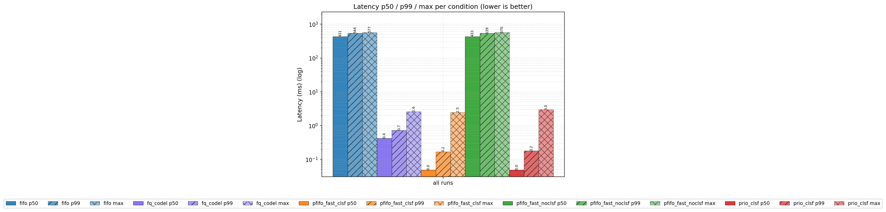
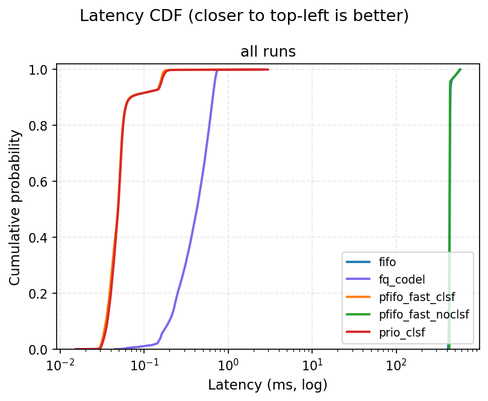
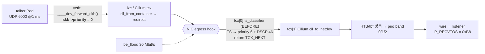

# Time-Sensitive Cloud-Native Network on eBPF — 재현, 반증, 재설계

[](https://github.com/CometWoo/time_sensitive_packet/actions/workflows/ci.yml)
[](https://github.com/CometWoo/time_sensitive_packet/actions/workflows/testbed.yml)
[English summary](README.en.md) · [설계 결정 기록(ADR)](docs/adr/README.md) · [결과](docs/RESULTS.md) · [한계](docs/LIMITATIONS.md) · [AIDC 연결](docs/AIDC_RELEVANCE.md)

> *Reproducing Wen et al., "A Time-Sensitive Cloud-Native Network Based on eBPF" (CSCWD 2024) on Cilium/Kubernetes —
> and discovering, from kernel source and measurement, why the first reproduction could not have worked:
> `skb->priority` is zeroed on every veth crossing, and Cilium's tcx programs hide legacy `clsact` filters.
> The redesign classifies at the host NIC egress via a tcx link placed before Cilium, marks DSCP for the fabric,
> and is verified by 26 BPF_PROG_TEST_RUN unit tests, a tcx-ordering integration test, and a contention testbed
> that runs in CI (p50 433 ms / 35 % loss → 0.05 ms / 0 loss).*

## 상태 (정직하게)

| | |
|---|---|
| **유효한 결과** | 2026-09 netns 테스트베드, GitHub Actions 러너 kernel 6.17, 병목 20 Mbit/s + best-effort 홍수. [`results/testbed/ci-34294518788`](results/testbed/ci-34294518788/) |
| **재해석한 결과** | 2026-05 VirtualBox 2-VM K8s 측정 9개 CSV. **우선순위 메커니즘이 작동하지 않은 상태**에서 측정됐음을 확인 → [docs/RESULTS.md §2](docs/RESULTS.md) |
| **미검증** | 새 설계의 **실제 Cilium 클러스터 실행**. 스크립트는 재작성했지만 현재 VM 에 접근할 수 없다 → [docs/VERIFICATION.md](docs/VERIFICATION.md) |

## 한눈에

- **만든 것** — 호스트 NIC egress 에 붙는 eBPF 분류기 `ts_classifier`(AVTP / 802.1Q·ad PCP / UDP 포트 → `skb->priority` 6, DSCP 46 + IPv4 체크섬 증분 갱신, per-CPU 카운터), libbpf tcx 로더(`BPF_F_BEFORE`), 단일 호스트 netns 테스트베드, 통계 패키지(`tsn-analysis`), Cilium/K8s 오케스트레이션, CI.
- **발견한 것** — ① veth 를 건너는 모든 패킷은 `____dev_forward_skb()` 에서 `skb->priority = 0` 이 된다(v5.15/v6.8 소스 + 실측 52,858/52,858). ② kernel ≥ 6.6 에서 Cilium tcx 프로그램이 `TC_ACT_OK` 를 반환하면 뒤의 legacy `clsact` 필터는 실행되지 않는다(CI 실측 0/21 → BEFORE 첨부 시 20/22). ③ 5월 실험은 경쟁 트래픽이 없었고 talker 가 패킷마다 DNS 를 질의했다.
- **배운 것** — 우선순위는 "어디서 찍느냐" 가 전부이고, 호스트 밖으로 나가는 신호는 DSCP/PCP 뿐이다. 경합이 없으면 QoS 는 관측되지 않는다. 지표보다 먼저 카운터·프로브·송신 품질을 봐야 한다.

## 핵심 결과 — 경합 하 TS 흐름 (러너 kernel 6.17, 조건당 3 run × 10,000 패킷)

| 조건 | 분류기 | latency p50 / p99 (ms) | 손실 | 수신 DSCP | 뜻 |
|---|---|---|---|---|---|
| `fifo` (pfifo) | 없음 | 431.3 / 543.7 | 35.2 % | 0 | 우선순위·AQM 없는 NIC 큐 |
| `fq_codel` (리눅스 기본) | 없음 | 0.42 / 0.73 | 0 | 0 | 흐름 공정 큐가 저속 흐름을 우대 |
| `pfifo_fast_noclsf` | 없음 | 433.2 / 538.9 | 38.9 % | 0 | **5월 설계의 실제 상태** — priority 0 이면 3-band 큐도 FIFO |
| `pfifo_fast_clsf` | **있음** | **0.05 / 0.17** | **0** | **46** | 커널 내장 qdisc + 분류기 |
| `prio_clsf` | **있음** | **0.05 / 0.18** | **0** | **46** | K8s "proposed" 가 의도한 상태 |

fifo 대비 p99 +99.97 % (Mann-Whitney p < 1e-300, Cliff's δ = +1.00). `pfifo_fast_noclsf` 와 `fifo` 는 통계적으로 같다(δ = −0.22).
priority 가 죽고 살아나는 지점의 실측(prio_probe): veth 직후 **{0: 52,858}** → 분류기 뒤 **{0: 42,858, 6: 10,000}**.

|  |  |
|---|---|

자세한 표·통계·재해석: [docs/RESULTS.md](docs/RESULTS.md). 데이터 출처: [docs/DATA_PROVENANCE.md](docs/DATA_PROVENANCE.md).

## 아키텍처



세부(커널 함수·줄 번호, v1 대비 표): [docs/ARCHITECTURE.md](docs/ARCHITECTURE.md). 논문 요소 대응: [docs/PAPER_MAPPING.md](docs/PAPER_MAPPING.md).

## 설계 결정 — 무엇을 고민했고 왜 이걸 골랐나

| 결정 | 대안들 | 선택한 이유 | ADR |
|---|---|---|---|
| 분류 지점 = **호스트 NIC egress** | Pod eth0 egress(6월 설계), 호스트측 veth ingress(5월, 논문 vef), cgroup/sockops, tc u32+skbedit | veth 뒤·qdisc 직전만이 priority 가 살아남는 유일한 지점 | [0003](docs/adr/0003-classify-at-host-nic-egress.md) |
| **tcx BEFORE + TC_ACT_UNSPEC** | legacy clsact, tcx AFTER, Cilium 프로그램 교체 | Cilium 이 OK 를 반환하면 뒤는 실행 안 됨; UNSPEC 이라야 Cilium 이 이어서 실행 | [0005](docs/adr/0005-tcx-before-cilium.md) |
| 병목 + 경쟁 트래픽 필수 | CPU 부하만(5월), NIC 포화, netem, tap 에뮬레이터, WSL 커널 재빌드 | 큐가 비면 우선순위는 무의미; tbf/HTB 아래 조건 qdisc 가 재현성 최고 | [0006](docs/adr/0006-testbed-needs-contention.md) |
| DSCP EF 마킹 | 앱 `IP_TOS`, iptables mangle, PCP 만 | skb->priority 는 NIC 밖에서 죽는다; 패브릭이 읽는 건 DSCP | [0007](docs/adr/0007-dscp-marking-for-fabric-qos.md) |
| 비교 조건 5개 | baseline/proposed 2개 | `noclsf` = `fifo` 로 인과 분리, fq_codel 의 sparse-flow 우대 정량화 | [0010](docs/adr/0010-qdisc-conditions.md) |
| `prio`/`pfifo_fast` (mqprio/ETF/taprio 아님) | 논문 스택 그대로 | 1 TX 큐 virtio, SO_TXTIME 없는 talker, TAI 불일치 — 실패 기록 | [0002](docs/adr/0002-prio-instead-of-mqprio-etf-taprio.md) |
| priority 6 + 기본 priomap | 3 + 커스텀 priomap(논문 Table I) | 권한 경계 ≤ 6, 커스텀 맵에서 0 → band 2 로 갔던 사고 | [0011](docs/adr/0011-priority-6-default-priomap.md) |
| 5월 데이터 보존·재분류 | 삭제 | 틀린 숫자를 찾아낸 과정이 핵심 | [0016](docs/adr/0016-results-provenance.md) |

전체 16개: [docs/adr/README.md](docs/adr/README.md). 모든 ADR 은 문제 → 대안(장단점) → 결정 → 결과/한계 순서다.

## 검증

| 무엇 | 방법 | 어디서 |
|---|---|---|
| 분류 규칙·DSCP·체크섬·설정 map·단편/절단/IPv6 | **26개 BPF_PROG_TEST_RUN 단위 테스트** (`bpftool prog run`, 크래프트 패킷) | `bpf/tests/`, CI `bpf` (kernel 6.17) + WSL2 5.15 |
| tcx 순서(OK 가 체인을 끊음 / BEFORE 로 둘 다 실행) | 통합 테스트 `test_tcx_chain.sh` | CI `bpf` — ALL PASS |
| veth priority 리셋, 분류기 카운터, DSCP 도착, 경합 하 latency/손실 | netns 테스트베드 3 run × 5 조건 | CI `testbed` 아티팩트 → `results/` |
| 통계 함수 | 65 pytest (Cliff's δ O(n log n) vs O(n²) 대조 등) | CI `analysis` |
| 셸/파이썬/매니페스트 | shellcheck / ruff / kubeconform | CI `lint` |
| **Cilium 클러스터 실행** | — | **미검증** ([docs/VERIFICATION.md](docs/VERIFICATION.md)) |

## 한계 (요약)

VirtualBox 1 TX 큐·소프트웨어 시계, CI 러너 공유 vCPU·veth 경로(물리 NIC 큐 없음), 파이썬 페이싱(수십 μs),
IPv6 미지원, UDP 포트 기준의 신뢰 경계 부재, 클러스터 재측정 미완. 전체 목록: [docs/LIMITATIONS.md](docs/LIMITATIONS.md).

## AI 데이터센터 네트워크와의 연결

`skb->priority`(호스트 내부) vs **DSCP**(패브릭이 읽는 신호), strict-priority 밴드 ↔ 스위치 egress 큐/DCB,
꼬리 지연 ↔ 집단 통신 straggler, PFC/ECN 과의 관계, CNI 와 공존하는 BPF 훅 — 대응표와 실 하드웨어 로드맵:
[docs/AIDC_RELEVANCE.md](docs/AIDC_RELEVANCE.md).

## 빠른 시작

```bash
# 1) eBPF 빌드 + 단위 테스트 (Linux, clang/libbpf-dev/linux-libc-dev/bpftool, root)
make -C bpf && make -C bpf tools
sudo make -C bpf test          # 26 BPF_PROG_TEST_RUN
sudo make -C bpf test-tcx      # kernel >= 6.6

# 2) netns 테스트베드 (sch_tbf/sch_prio 가 있는 커널이면 경합 실험, 없으면 기능 검증 모드)
sudo bash testbed/run.sh --runs 3 --rate-mbps 20 --flood-mbps 30 --out testbed/runs/local

# 3) 분석
python -m pip install -e ./analysis
tsn-analysis summary testbed/runs/local --baseline fifo --markdown - && tsn-analysis plot testbed/runs/local --out figs

# 4) Kubernetes/Cilium 클러스터 (VM 2대) — docs/RUNBOOK.md
cp experiment.env.example experiment.env && sudo bash scripts/experiment.sh build-ebpf && sudo bash scripts/experiment.sh matrix 3
```

CI 가 같은 일을 매 push 마다 한다(`.github/workflows/`). Windows 에서는 WSL2 로 1)–3) 이 돈다(셰이퍼 없이).

## 저장소 구조

```
bpf/            eBPF: src/{ts_classifier,prio_probe,tcx_dummy_ok}.c · tools/tcx_attach.c · tests/ (BPF_PROG_TEST_RUN, tcx chain) · Makefile
workload/       talker.py · listener.py · be_flood.py · udp_sink.py   (테스트베드와 K8s 가 같은 파일을 사용)
testbed/        topology.sh · run.sh · bpfmaps.py                     (단일 호스트 netns 테스트베드)
k8s/            kustomization.yaml · listener/udp-sink · talker-job/be-flood-job/stress-daemonset 템플릿
scripts/        experiment.sh (K8s 오케스트레이션) · verify.sh · hubble-monitor.sh · setup/ (VM 설치) · qdisc-reference/ (mqprio/ETF/taprio, 참고용) · ci/
analysis/       tsn_analysis 패키지 (loader/metrics/stats/plots/report/cli) + tests
results/        testbed/ (CI 실측: CSV · meta.json · report) · k8s-2026-05/ (5월 K8s 데이터 + 그래프, 재해석용)
docs/           ARCHITECTURE · RESULTS · LIMITATIONS · VERIFICATION · DATA_PROVENANCE · PAPER_MAPPING · AIDC_RELEVANCE · RUNBOOK · adr/
.github/        ci.yml (lint · bpf · analysis) · testbed.yml (실험 → 아티팩트)
Makefile · experiment.env.example · CHANGELOG.md · LICENSE
```

## 로드맵

1. VM 클러스터에서 `scripts/experiment.sh matrix` 실행 → `results/k8s/` (veth 리셋·DSCP 를 Cilium 경로에서 재확인)
2. 출발지 identity 기반 분류(신뢰 경계), IPv6 Traffic Class
3. 물리 NIC: `mqprio hw`, XPS/IRQ affinity, isolcpus, 하드웨어 PTP + `SO_TIMESTAMPING`
4. 스위치 QoS(trust DSCP, strict-priority 큐)와 RoCE/PFC 클래스 공존 실험

## 참고

- J. Wen, J. Ge, Z. Zhang, H. Li, Y. E, B. Wu, "A time-sensitive cloud-native network based on eBPF," *Proc. 27th IEEE CSCWD*, 2024, pp. 2577–2582. DOI 10.1109/CSCWD61410.2024.10580477
- Linux: `include/linux/netdevice.h` `____dev_forward_skb`, `net/core/dev.c` `sch_handle_egress`, `kernel/bpf/mprog.c`, `net/sched/sch_prio.c`, `net/sched/sch_etf.c`
- Cilium datapath / tcx: https://docs.cilium.io — 변경 이력: [CHANGELOG.md](CHANGELOG.md)
