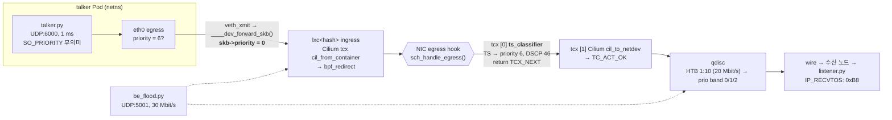

# 아키텍처 — 패킷이 지나는 길과 우선순위가 살아남는 지점

## 1. 데이터패스 (v2, 2026-09)



핵심 지점 세 곳:

| 지점 | 커널 함수 (v6.8 기준) | 무슨 일이 일어나나 |
|---|---|---|
| veth 통과 | `drivers/net/veth.c veth_forward_skb` → `net/core/dev.c __dev_forward_skb2` → `include/linux/netdevice.h ____dev_forward_skb` L4110 | `skb->priority = 0`. Pod 안의 모든 우선순위 표식이 지워진다 |
| NIC egress hook | `net/core/dev.c __dev_queue_xmit` L4293 `sch_handle_egress` → `tcx_run` → (`TC_ACT_UNSPEC` 이면) `tc_run` | 여기서 설정한 priority/DSCP 를 바로 다음 단계인 qdisc 가 본다 |
| qdisc enqueue | `__dev_queue_xmit` L4317 `__dev_xmit_skb` → `sch_htb` → 자식 `sch_prio prio_classify` (`prio2band[priority & 15]`) | priority 6 → band 0 → 먼저 dequeue |

## 2. 구성 요소

| 디렉터리 | 역할 | 검증 |
|---|---|---|
| `bpf/src/ts_classifier.c` | 분류기: AVTP / 802.1Q·ad PCP ≥ 5 / IPv4-UDP dport(6000 + map) → priority, DSCP, PERCPU 카운터. IP 단편·IPv6 는 건드리지 않음 | 24+2 BPF_PROG_TEST_RUN 테스트, verifier 로드 (5.15, 6.17) |
| `bpf/src/prio_probe.c` | `skb->priority` 히스토그램 (veth 리셋 증명) | 테스트베드 실측 |
| `bpf/src/tcx_dummy_ok.c` | Cilium 흉내 (TC_ACT_OK) | `tests/test_tcx_chain.sh` |
| `bpf/tools/tcx_attach.c` | libbpf tcx 링크 attach (BPF_F_BEFORE/AFTER, pin, query) | CI (kernel 6.17) |
| `testbed/` | netns 토폴로지(Pod ↔ veth ↔ host ↔ veth), tbf 병목, BE 홍수, 조건별 러너, 메타데이터 | WSL2(기능), CI(경합) |
| `workload/` | talker/listener + K8s 매니페스트(kustomize) | 테스트베드에서 같은 파일 사용 |
| `scripts/experiment.sh` | K8s 클러스터 실험 오케스트레이션 (HTB + u32 + 조건 qdisc + tcx attach + Job/DaemonSet) | **클러스터 미실행** |
| `analysis/` | 통계·그래프·리포트 (`tsn-analysis`) | 65 pytest |
| `.github/workflows/` | lint / BPF build+test+tcx / analysis / testbed 실험 | 실행 중 |

## 3. 테스트베드 토폴로지

```
 ns_send (10.10.1.2)          host netns                          ns_recv (10.10.2.2)
 ┌──────────────┐   vs_ns──vs_host      routing      vr_host──vr_ns   ┌──────────────┐
 │ talker.py    │ ─────────▶ │ prio_probe(ingress) │ ─────▶ │ ts_classifier(pref 10) │ ────▶ │ listener.py  │
 │ be_flood.py  │            │  = veth 직후 priority │       │ prio_probe(pref 20)     │       │ udp_sink.py  │
 └──────────────┘            └───────────────────────┘       │ root: tbf 20 Mbit/s     │       └──────────────┘
                                                             │  └ leaf: {pfifo | fq_codel | pfifo_fast | prio} │
```

`vr_host` 가 "물리 NIC" 역할이다. 두 프로브의 히스토그램 차이가 곧 "priority 가 어디서 죽고 어디서
살아나는가" 의 실측이다.

## 4. v1(2026-05) 과의 차이

| | v1 (측정된 구성) | v2 (현재) |
|---|---|---|
| priority 설정 지점 | Pod 소켓 `SO_PRIORITY=3` (+ 실행되지 않은 호스트 BPF) | 호스트 NIC egress `ts_classifier` |
| Cilium 과의 관계 | legacy clsact → tcx 에 가려 미실행 | tcx BEFORE + TCX_NEXT |
| 경쟁 트래픽 | 없음 | BE 홍수 + tbf/HTB 병목 |
| 대조군 | 기본 qdisc(fq_codel) | fifo / fq_codel / pfifo_fast(±clsf) / prio+clsf |
| 시계 | 두 VM, 14–37 ms 오프셋 | 테스트베드 같은 시계 |
| talker | 패킷마다 DNS, 500m CPU 한도 | 1회 해석, 한도 없음 |
| 검증 | 없음 (정적) | 단위 테스트 + tcx 통합 + 테스트베드 실측 + CI |
