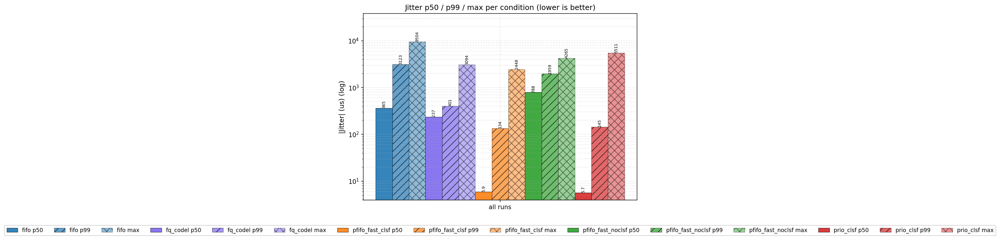
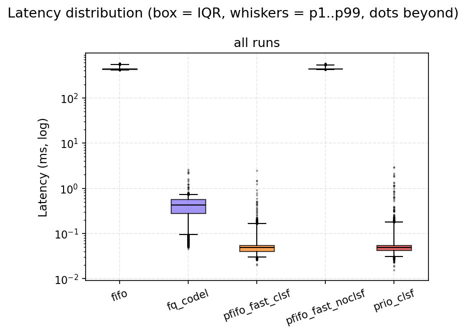

# 결과

두 세대의 데이터가 있다. **9월 netns 테스트베드(CI 러너)** 가 이 프로젝트의 유효한 결과이고,
**5월 K8s 2-VM 측정** 은 메커니즘이 작동하지 않은 상태의 데이터로 재해석해 보존한다
([ADR-0016](adr/0016-results-provenance.md)). 모든 숫자는 `tsn-analysis summary` 출력에서 가져왔다
([ADR-0015](adr/0015-statistics.md)).

---

## 1. netns 테스트베드 — 경합 하 우선순위 실험 (2026-09-09, GitHub Actions ubuntu-24.04)

- 커널 `6.17.0-1022-azure`, 병목 `tbf rate 20mbit` 아래 조건별 qdisc, BE 홍수 30 Mbit/s(1400 B UDP:5001),
  TS 흐름 128 B UDP:6000 @ 1 ms × 10,000, 조건당 3 run, 송수신 같은 시계(절대 one-way latency 유효).
- 원본: [`results/testbed/ci-34294518788/`](../results/testbed/ci-34294518788/) (CSV, `.meta.json`,
  `report/summary.md`, 그래프). 재현: `.github/workflows/testbed.yml` 또는 `sudo bash testbed/run_testbed.sh`.

### 1.1 헤드라인

| 조건 | 분류기 | latency p50 / p99 / max (ms) | jitter p99 (μs) | 손실 | 수신 DSCP |
|---|---|---|---|---|---|
| `fifo` (pfifo, 우선순위·AQM 없음) | 없음 | **431.3 / 543.7 / 577.3** | 3123 | **35.2 %** | 0 |
| `fq_codel` (리눅스 기본, 흐름 공정 큐) | 없음 | 0.42 / 0.73 / 2.60 | 401 | 0 | 0 |
| `pfifo_fast_noclsf` (3-band, priority 0) | 없음 | **433.2 / 538.9 / 570.4** | 1959 | **38.9 %** | 0 |
| `pfifo_fast_clsf` | **있음** | **0.05 / 0.17 / 2.48** | 134 | 0 | **46 (EF)** |
| `prio_clsf` | **있음** | **0.05 / 0.18 / 2.97** | 145 | 0 | **46 (EF)** |

(n = 30,000 패킷/조건, 3 run 합산. per-run p99 의 95 % t-구간: fifo 541.7–545.5, fq_codel 0.71–0.74,
pfifo_fast_clsf 0.16–0.18, prio_clsf 0.15–0.20 ms.)

`fifo` 대비 개선율 — latency p99: fq_codel +99.87 %, `*_clsf` +99.97 % (Mann-Whitney p < 1e-300,
Cliff's δ = +1.00). `pfifo_fast_noclsf` 는 fifo 와 통계적으로 같다(p99 +0.89 %, δ = −0.22).

### 1.2 읽는 법 — 무엇이 무엇을 증명하나

1. **`pfifo_fast_noclsf` = `fifo`.** 3-밴드 우선순위 큐가 있어도 priority 가 0 이면 모든 패킷이
   band 1 에 줄을 서고 TS 패킷도 39 % 가 버려진다. 이것이 **5월 K8s "proposed" 의 실제 상태**였다
   (Pod 의 `SO_PRIORITY` 는 veth 에서 0 으로 리셋 — 아래 1.3 의 실측).
2. **`*_clsf`**: 호스트 NIC egress 의 `ts_classifier` 가 priority 6 을 찍자 같은 qdisc 에서 p50 이
   433 ms → 0.05 ms(약 8,600배), 손실 39 % → 0. 20 Mbit/s 링크에서 1400 B 패킷 하나의 직렬화 시간이
   0.56 ms 이므로 p99 0.17 ms 는 "현재 전송 중인 패킷조차 거의 기다리지 않는" 수준 — tbf 의 토큰
   버스트 덕에 TS 패킷이 즉시 나간 것으로 해석된다.
3. **`fq_codel` 은 손실 0 에 p99 0.73 ms** — 흐름 단위 공정 큐(DRR)가 저속 TS 흐름을 자동으로
   우대한다(sparse flow). 그러나 strict priority 보다 4배 느리고, 이 우대는 호스트 안에서만 일어난다
   (패브릭 스위치에는 흐름 단위 큐가 없다) — [AIDC_RELEVANCE.md](AIDC_RELEVANCE.md).
4. **DSCP 46 이 수신단에 도착**했다(30,000/30,000). IPv4 헤더 체크섬을 증분 갱신했기 때문에 수신
   커널이 패킷을 버리지 않았다(잘못된 체크섬이면 손실로 나타났을 것).
5. `prio_clsf` 와 `pfifo_fast_clsf` 가 같다 — 커널 내장 `pfifo_fast` 만으로도 충분하며, 모듈 없는
   커널(WSL2 등)에서도 같은 효과를 낼 수 있다.

### 1.3 priority 가 죽고 살아나는 지점 (prio_probe 히스토그램, run 3 기준)

| 관측 지점 | priority 0 | priority 6 |
|---|---|---|
| veth 를 건넌 직후 (호스트측 veth ingress) — talker 는 `SO_PRIORITY=6` | **52,858** | **0** |
| NIC egress, `ts_classifier` 뒤 (`*_clsf` 조건) | 42,858 | **10,000** |
| NIC egress, 분류기 없음 (`pfifo_fast_noclsf`) | 52,860 | 0 |

분류기 카운터(`ts_counters`, `*_clsf`): normal 42,858 / ts_udp 10,000 / dscp_marked 10,000 / parse_short 0.
WSL2(kernel 5.15) 에서도 동일한 히스토그램을 얻었다(27,110 → 0; 셰이퍼 없어 latency 비교는 생략).

### 1.4 그래프

| | |
|---|---|
|  |  |
|  |  |

### 1.5 한계

CI 러너는 공유 vCPU 이며 veth 경로라 물리 NIC/드라이버 큐가 없다. talker 페이싱은 파이썬(수십 μs
오차). 절대값은 이 환경의 것이고, 조건 간 **차이의 크기와 방향** 이 결론이다. 자세한 목록:
[LIMITATIONS.md](LIMITATIONS.md).

---

## 2. 2026-05 K8s 2-VM 측정 — 재해석

- 구성(commit `8fc0be1`): Ubuntu 24.04 / kernel 6.x / K8s 1.30 / Cilium 1.19 native routing, VirtualBox VM 2대,
  talker Pod(master) → listener Pod(worker), UDP 5000, `SO_PRIORITY=3`, proposed = `prio bands 3 priomap
  2 2 1 0 …`, baseline = root qdisc 삭제(배포판 기본 fq_codel), stress-ng CPU 부하 10/30/50/70(/99) %,
  **경쟁 네트워크 트래픽 없음**, 호스트측 BPF 는 tcx 순서로 미실행(카운터 0).
- 원본: `step8-measurement/results/*.csv` (10,000 행 × 9). 파일별 출처: [DATA_PROVENANCE.md](DATA_PROVENANCE.md).

### 2.1 당시 표 (p1 정규화, 선형 백분위, `tsn-analysis summary --normalize-skew`)

| CPU | latency p99 baseline → proposed (ms) | 개선 | jitter p99 baseline → proposed (μs) | Cliff's δ |
|---|---|---|---|---|
| 10 % | 13.02 [12.0, 16.5] → 3.42 [3.2, 3.7] | +73.7 % | 12,928 → 3,266 | +0.41 (medium) |
| 30 % | 8.21 → 5.94 | +27.6 % | 8,308 → 5,836 | +0.25 (small) |
| 50 % | 12.08 → 7.04 | +41.7 % | 11,758 → 6,717 | +0.49 (large) |
| 70 % | 11.78 → 11.64 | +1.1 % | 11,956 → 9,393 | +0.10 (negligible) |

### 2.2 왜 이 표가 우선순위 큐의 효과가 아닌가

| 사실 | 근거 |
|---|---|
| Pod 의 `SO_PRIORITY=3` 은 호스트에 0 으로 도착 | `____dev_forward_skb()` (netdevice.h), 테스트베드 실측 |
| 커스텀 priomap `2 2 1 0…` 에서 priority 0 → **band 2(최하위)** | `sch_prio.c prio_classify` |
| 큐에 경쟁이 없어 어떤 qdisc 든 비어 있었다 | stress-ng 는 CPU 만 소모; 유일한 흐름은 30–70 KB/s |
| 호스트 BPF(vef/eg/ig) 는 실행되지 않았다 | Cilium tcx 가 OK/REDIRECT 반환 → legacy clsact 스킵 |
| talker 실효 216–547 pkt/s (목표 1,000), 송신 간격 p99 4–14 ms | CSV `send_ns` 재계산; 패킷마다 `getaddrinfo()` + CFS quota 500m |
| latency 에 DNS 왕복이 포함 | `send_time_ns` 스탬프 뒤에 `sendto(hostname)` 해석 |
| 시계 오프셋 −14 ~ −37 ms, cpu70 run 사이 22 ms 스텝 | raw latency 99 % 음수 |

따라서 baseline/proposed 차이는 fq_codel vs prio(단일 밴드)의 코드 경로·AQM 차이, 실행 시각에 따른 VM/DNS
잡음, 송신 페이싱 차이가 섞인 것이며, 우선순위 dequeue 는 한 번도 일어나지 않았다.

### 2.3 그래도 남는 정보

- VM 환경 절대 지연(p50 0.8–1.4 ms 상대값)과 하이퍼바이저 스톨(max 1.5–3.8 s)의 크기.
- "지표가 좋아 보이는데 메커니즘이 없을 수 있다" 는 교훈 — 송신 간격 분포·카운터·프로브 없이 latency 표만
  보면 틀린 결론에 이른다.

---

## 3. K8s 클러스터 재측정 (미완료)

새 설계로 클러스터에서 재측정하는 `deploy-experiment.sh matrix` 는 구현했지만, 이 시점에 VM 클러스터에
접근할 수 없어 실행하지 못했다. 실행 시 결과는 `results/k8s/<date>/` 에 `<condition>_cpu<N>_run<k>.csv`
+ `.meta.json` 으로 쌓이고 같은 `tsn-analysis` 로 요약된다. 기대: `pfifo_fast_noclsf` ≈ `fifo` (veth 리셋
재확인), `*_clsf` 에서 HTB 20 Mbit/s 병목 하 p99 수 ms 이하, 수신 DSCP 46.
